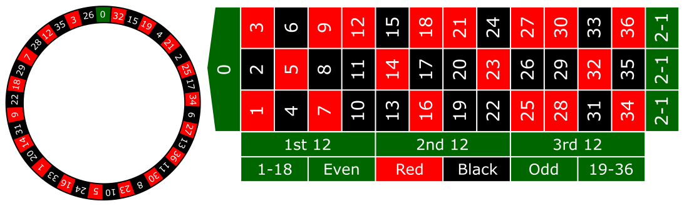

# Ruletka

Celem zadania jest implementacja zasad gry w ruletkę. Reguły zostały oparte o wariant europejski gry.

## Reguły gry

Ruletka podzielona jest na tzw. **spiny**, czyli rzuty kulką po okręgu obracającego się koła ruletki posiadającej **37 przegródek** oznaczonych przez **liczby od 1 do 36 oraz 0**. Znajdujące się w kole liczby wieksze od zera dodatkowo posiadają czerwony lub czarny kolor. W każdym spinie gracze obstawiają **wybrane numery lub ich kombinacje** przy pomocy otrzymanych od krupiera kolorów żetonów (kolor identyfikuje gracza). Krupier wypowiadając formułę _no more bets_ (lub językowy odpowiednik) kończy fazę obstawiania i po zatrzymaniu się kulki w przegrodzie zbiera przegrywające żetony i wypłaca wygrane.

### Rodzaje zakładów

Gracz w każdym spinie może obstawić dowolną liczbę pól i kombinacji, o ile mieszczą się one w limitach poszczególnych zakładów i gracz posiada odpowiednią liczbę żetonów. Limity stołu ustalane są przez prowadzącego grę.

W grze istnieją dwa warianty zakładów: wewnętrzne i zewnętrzne. Jeżeli gracz chce postawić zakład wewnątrz planszy głównej (tj. na polach oznaczonych od 0 do 36), ma do wyboru następujące opcje:
- zakład na pojedyńczy numer (_straight_);
- zakład na dwa sąsiadujące ze sobą numery (_split_), np. 4-5, 14-17, 0-2;
- zakład na trzy sąsiadujące ze sobą kolejno w linii numery (_street_), np. 7-8-9, 19-20-21 ale również 0-1-2 oraz 0-2-3;
- zakład na cztery sąsiadujące ze sobą numery (_corner_), gdzie punktem wyznaczającym sąsziedztwo jest punkt przecięcia linii, np. 5-6-8-9, 16-17-19-20,
- zakład na sześć sąsiadujących ze sobą numerów (_line_), są to dwa zakłady _street_ obok siebie, np. 7-8-9-10-11-12, 31-32-33-34-35-36.

Jeżeli gracz chce postawić zakład zewnętrzny, ma do wyboru następujące opcje:
- zakład na jedną z trzech kolumn złożonych z tuzina numerów (_column_), np. 1-4-7-10-13-16-19-22-25-28-31-34;
- zakład na jedną z trzech grup numerów złożonych z tuzina numerów (_dozen_) tj. od 1 do 12, od 13 do 24 i od 25 do 36;
- zakład na wysokie numery (_high_), tj. od 19 do 36;
- zakład na niskie numery (_low_), tj. od 1 do 18;
- zakład na czarny lub czerwony kolor (_colour_), gdzie **0 nie ma koloru**;
- zakład na numery parzyste, ale wypadnięcie **0 przegrywa ten zakład** ;
- zakład na numery nieparzyste;

### Wypłata

Po zatrzymaniu się kulki krupier zabiera przegrane żetony i wypłaca nagrody za poprawne zakłady. Przez wypłatę rozumiany jest zwrot wpłaconych żetonów wraz z dodatkowymi żetonami wynikającymi z współczynnika wypłaty. Współczynnik wypłaty ma postać **1:5**, która oznacza, że za każdy postawiony żeton gracz otrzyma wpłacony żeton plus 5 dodatkowych, w sumie 6. Każdy rodzaj zakładu ma różny współczynnik wypłaty, co zostało przedstawione w poniższej tabeli:

Zakład|Współczynnik wypłaty
------|--------------------
Zakład na numery nieparzyste|1:1
Zakład na numery parzyste|1:1
Zakład na czarny lub czerwony kolor|1:1
Zakład na niskie numery|1:1
Zakład na wysokie numery|1:1
Zakład na jedną z trzech grup numerów złożonych z tuzina numerów|1:2
Zakład na jedną z trzech kolumn złożonych z tuzina numerów|1:2
Zakład na sześć sąsiadujących ze sobą numerów|1:5
Zakład na cztery sąsiadujące ze sobą numery|1:8
Zakład na trzy sąsiadujące ze sobą kolejno w linii numery|1:11
Zakład na dwa sąsiadujące ze sobą numery|1:17
Zakład na pojedyńczy numer|1:35

## Wytyczne do zadania

Zaimplementuj grę w ruletkę wg. powyższych reguł. Program ma działać w trybie tekstowym. Gracz na start otrzymuje 100 żetonów i za pomocą komend tworzy zakłady (składnie komend tworzących zakład należy zdefiniować samemu). Wpisanie komendy *no more bets* uruchamia generator losowej liczby i rozliczba obstawione zakłady. Następnie program znów prosi gracza o zakłady i tak bez końca, chyba, że graczowi skończa się żetony, co jest równoznaczne z przegraną.

Implementacja kodu powinna spełniać zasady dobrego kodowania oraz być należycie wytestowana z pomocą automatycznych testów. 

Grafika pochodzi z [commons.wikimedia.org](https://commons.wikimedia.org/wiki/File:European_roulette.svg).
